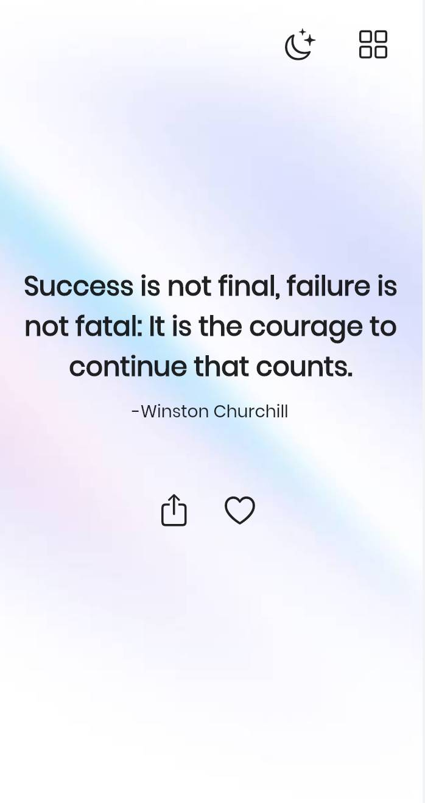
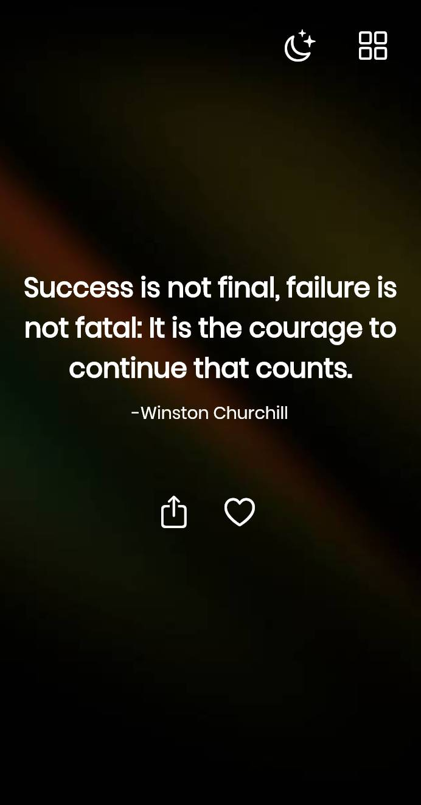

# Motivator  -- Minimalistic Flutter Quotes App

A simple quotes app built in flutter for the web. This app sends push notifications to iOS users right from the web. You can use this project as a starting point to get familiarized with the newly introduced Push API beta feature on iOS 16.4.

## Getting Started

This project is a starting point for a Flutter application.

A few resources to get you started if this is your first Flutter project:

- [Lab: Write your first Flutter app](https://flutter.dev/docs/get-started/codelab)
- [Cookbook: Useful Flutter samples](https://flutter.dev/docs/cookbook)

For help getting started with Flutter, view our
[online documentation](https://flutter.dev/docs), which offers tutorials,
samples, guidance on mobile development, and a full API reference.
